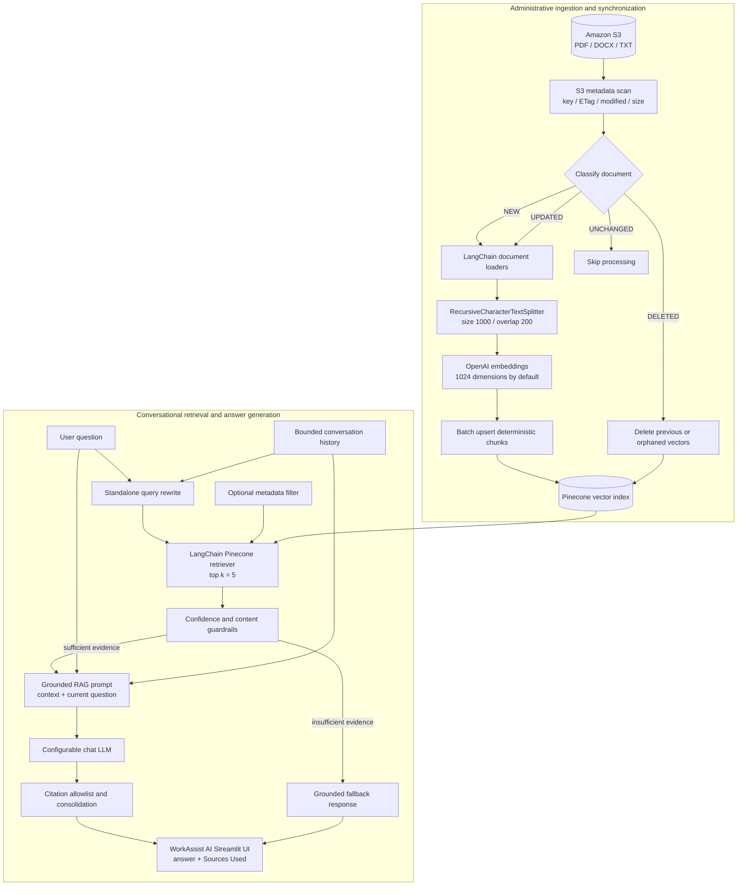

# WorkAssist AI

> Agentic Employee Support and PTO Assistant

WorkAssist AI is an agentic employee-support application for PTO balance assistance and retrieval-augmented search across organizational documents stored in Amazon S3. It routes personal PTO questions to AWS MySQL and document questions to Pinecone-backed RAG, then presents answers through a Streamlit chat interface.

The application also includes administrative synchronization, metadata-aware search, conversational follow-up handling, RAG guardrails, and structured production logging.

## Project overview

Important organizational knowledge is frequently distributed across policies, handbooks, reports, and other files. Finding an answer manually can require opening several documents and searching each independently. A general-purpose LLM may respond quickly, but it cannot be trusted to know private documents and may fabricate unsupported details.

WorkAssist AI solves this problem by:

- using Amazon S3 as the source-of-truth document repository;
- indexing document content in Pinecone for semantic search;
- supplying only retrieved evidence to the LLM;
- returning document and page citations with supported answers;
- refusing to answer when retrieval confidence is insufficient; and
- incrementally synchronizing new, changed, unchanged, and deleted S3 objects.

## Features

- PDF, TXT, and DOCX ingestion from Amazon S3
- Recursive text chunking with configurable size and overlap
- OpenAI embeddings with configurable model and dimensions
- Batched Pinecone ingestion with deterministic vector IDs
- Incremental S3 synchronization using ETag, size, and modification time
- Removal of Pinecone vectors for documents deleted from S3
- Semantic search with configurable `top_k` and confidence threshold
- Pinecone-side filtering by document name or file type
- Conversational follow-up question rewriting
- Grounded RAG answers with consolidated source citations
- Prompt-injection and secret-exfiltration guardrails
- Separate Chat and Admin Streamlit interfaces
- JSON structured logging with secret redaction
- User-friendly production error handling

## Technology stack

- Python 3.11+
- LangChain
- Amazon S3 and Boto3
- Pinecone and LangChain Pinecone
- `RecursiveCharacterTextSplitter`
- OpenAI embeddings
- Configurable OpenAI or Groq chat LLM
- Streamlit
- `uv` for dependency and virtual-environment management
- Pytest and Ruff

## Architecture

WorkAssist AI has separate orchestration paths for administrative ingestion, employee PTO assistance, and grounded document questions.



## Project folder structure

```text
DocuVerse/
|-- app/
|   |-- api/
|   |   |-- routes.py              # FastAPI routes
|   |   `-- schemas.py             # Request and response models
|   |-- services/
|   |   |-- rag_service.py
|   |   |-- pinecone_service.py
|   |   `-- s3_service.py
|   |-- core/
|   |   `-- config.py              # HTTP API configuration
|   `-- main.py                    # FastAPI application entry point
|-- app.py                         # Existing Streamlit UI implementation
|-- streamlit_app.py               # Recommended Streamlit entry point
|-- src/
|   |-- __init__.py
|   |-- config.py                  # Validated environment configuration
|   |-- s3_loader.py               # S3 listing, download, and extraction
|   |-- document_processor.py      # Recursive chunking and chunk IDs
|   |-- embeddings.py              # Provider-neutral embedding boundary
|   |-- vector_store.py            # Pinecone and synchronization logic
|   |-- retriever.py               # Semantic search and metadata filters
|   |-- rag_chain.py               # Conversational RAG pipeline
|   |-- guardrails.py              # Input, evidence, injection, secret guards
|   `-- logging_config.py          # Structured and redacted JSON logs
|-- tests/                         # Unit and workflow tests
|-- .streamlit/
|   `-- config.toml                # Production-safe error display
|-- .env                           # Local configuration; never commit
|-- .gitignore
|-- pyproject.toml
|-- requirements.txt               # pip-compatible dependency list
|-- uv.lock
`-- README.md
```

## Prerequisites

- Python 3.11 or newer
- `uv`
- An AWS account and accessible S3 bucket
- AWS credentials with the required S3 permissions
- A Pinecone account and existing index
- An OpenAI API key for embeddings
- An API key for the configured chat provider

Verify the local tools:

```powershell
python --version
uv --version
```

## AWS S3 configuration

Create an S3 bucket using a lowercase, globally unique name. Upload PDF, TXT, or DOCX files; unsupported object types are ignored.

The AWS principal used by WorkAssist AI should have only the permissions it needs:

- `s3:ListBucket` on the configured bucket;
- `s3:GetObject` for supported documents; and
- access to all prefixes that should be indexed.

WorkAssist AI uses Boto3's standard AWS credential chain. Local access-key variables are supported, but AWS profiles, workload credentials, and IAM roles are preferred where available.

```dotenv
S3_BUCKET_NAME=your-lowercase-bucket-name
```

## Pinecone setup

Create the Pinecone index before ingestion. Its dimensions must exactly match the embedding model output.

Current defaults:

- embedding model: `text-embedding-3-small`;
- embedding dimensions: `1024`;
- Pinecone index dimensions: `1024`;
- recommended metric: cosine; and
- optional namespace configured with `PINECONE_NAMESPACE`.

WorkAssist AI connects to the existing index and validates its dimension before indexing or retrieval. If an index has a different dimension, create a compatible index or deliberately change `OPENAI_EMBEDDING_DIMENSIONS` and reindex everything. Do not mix vectors created with different embedding configurations.

## Environment variables

Create `.env` in the project root. Replace these placeholders locally and never commit the completed file.

```dotenv
# Amazon S3
AWS_ACCESS_KEY_ID=your-aws-access-key-id
AWS_SECRET_ACCESS_KEY=your-aws-secret-access-key
AWS_REGION=us-west-2
S3_BUCKET_NAME=your-lowercase-bucket-name

# Pinecone
PINECONE_API_KEY=your-pinecone-api-key
PINECONE_INDEX_NAME=your-existing-index-name
PINECONE_NAMESPACE=
PINECONE_BATCH_SIZE=100

# Embeddings
EMBEDDING_PROVIDER=openai
OPENAI_API_KEY=your-openai-api-key
OPENAI_EMBEDDING_MODEL=text-embedding-3-small
OPENAI_EMBEDDING_DIMENSIONS=1024

# Chat model: openai or groq
CHAT_PROVIDER=openai
OPENAI_CHAT_MODEL=gpt-5.4-mini
GROQ_API_KEY=your-groq-api-key
GROQ_MODEL=openai/gpt-oss-120b

# Chunking and retrieval
CHUNK_SIZE=1000
CHUNK_OVERLAP=200
RETRIEVER_TOP_K=5
RETRIEVAL_MIN_SCORE=0.3

# Streamlit-to-FastAPI connection
FASTAPI_URL=http://localhost:8000

# Backend-issued signed access tokens
# Generate a unique random secret of at least 32 characters; never commit it.
AUTH_TOKEN_SECRET=replace-with-a-long-random-secret
AUTH_TOKEN_TTL_SECONDS=1800

# DEBUG, INFO, WARNING, or ERROR
LOG_LEVEL=INFO
```

Only the selected chat provider key is required for answer generation. `OPENAI_API_KEY` remains required while OpenAI is the embedding provider.

## Installation using uv

```powershell
cd C:\path\to\DocuVerse
uv sync
uv sync --group dev
```

Verify the project:

```powershell
uv run ruff check .
uv run pytest -q
```

## Running locally

Start Streamlit from the directory containing `app.py` and `.env`:

```powershell
uv run streamlit run streamlit_app.py
```

Open the URL printed by Streamlit, normally `http://localhost:8501`.

The sidebar provides two separate sections:

- **Chat** for document questions, sources, and search filters.
- **Admin** for S3-to-Pinecone synchronization and statistics.

Start the FastAPI backend in a separate terminal:

```powershell
uv run uvicorn app.main:app --reload
```

The backend is normally available at `http://127.0.0.1:8000`. Interactive API
documentation is available at `http://127.0.0.1:8000/docs`.

Initial endpoints:

| Method | Endpoint | Purpose |
|---|---|---|
| `GET` | `/health` | Root service health check. |
| `GET` | `/api/v1/health` | Lightweight application health check. |
| `GET` | `/api/v1/repository/status` | Read S3 and Pinecone repository status. |
| `POST` | `/api/v1/query` | Run the existing guarded conversational RAG pipeline. |

The core Pydantic API contract is:

```json
{
  "question": "What is the document retention policy?"
}
```

Responses preserve the submitted question and return the grounded answer and
sources. The conversational query endpoint additionally returns the standalone
retrieval query used for Pinecone search.

Both FastAPI and Streamlit use the framework-neutral
`app.services.rag_service.ask_question()` function. UI and HTTP concerns remain
outside the service, while the existing LangChain pipeline handles embedding,
Pinecone retrieval, grounded generation, guardrails, and citations.

## Document ingestion process

In **Admin**, select **Sync Documents**. WorkAssist AI then:

1. Lists supported S3 objects.
2. Reads key, ETag, last-modified timestamp, and size.
3. Compares S3 objects with versions represented in Pinecone.
4. Classifies each object as `NEW`, `UPDATED`, or `UNCHANGED`.
5. Detects indexed documents deleted from S3.
6. Downloads only new or updated files to temporary storage.
7. Extracts text with the appropriate LangChain loader.
8. Deletes temporary files automatically.
9. Continues when an individual file is corrupt or unreadable.
10. Chunks and embeds successfully loaded documents.
11. Removes exact previous-version or deleted-document vector IDs.
12. Batch-upserts new vectors and reports statistics.

## Chunking strategy

`src/document_processor.py` uses `RecursiveCharacterTextSplitter` with defaults:

```text
chunk_size    = 1000
chunk_overlap = 200
```

Every non-empty chunk preserves original metadata and adds:

- `chunk_id`: a deterministic UUID derived from document identity, version, page, position, and content hash;
- `chunk_index`: its zero-based position within the extracted document or page.

Overlap preserves meaning across boundaries, while deterministic IDs prevent duplicate insertion of identical versions.

## Embedding process

`src/embeddings.py` exposes the provider-neutral `get_embedding_model()` boundary. The initial provider is OpenAI, requesting 1024-dimensional embeddings by default.

The vector-store connection embeds a validation query and compares its dimension with Pinecone before ingestion. Full embedding vectors and credentials are never printed in the UI or logs.

## Pinecone vector storage

`src/vector_store.py` uses the Pinecone SDK and LangChain integration to:

- connect to an existing index and validate dimensions;
- preserve document, page, S3, version, and chunk metadata;
- use deterministic `chunk_id` values as vector IDs;
- avoid duplicate IDs and insert in configurable batches; and
- isolate batch failures so later batches continue.

Stored metadata includes:

```text
source, s3_key, filename, file_type, file_size,
etag, last_modified, document_id, document_version,
page, page_number, chunk_id, chunk_index
```

## Retrieval process

For each question, WorkAssist AI:

1. Validates input.
2. Rewrites a follow-up into a standalone query when bounded history exists.
3. Embeds that query with the ingestion embedding model.
4. Sends similarity search directly to Pinecone.
5. Applies an optional Pinecone filter for `filename` or `file_type`.
6. Retrieves five chunks by default.
7. Removes matches below `RETRIEVAL_MIN_SCORE`.
8. Sanitizes untrusted text before constructing the prompt.

**All Documents** sends no metadata filter. Filtering occurs in Pinecone rather than after retrieval.

## RAG workflow

```text
Current question + bounded recent history
                    |
                    v
          Standalone query rewrite
                    |
                    v
       Pinecone similarity retrieval
                    |
                    v
        Confidence/content guardrails
                    |
                    v
Retrieved context + current question + intent-only history
                    |
                    v
             Configured chat LLM
                    |
                    v
         Citation validation and UI
```

History is bounded by message count and characters. It resolves references such as "it" but is not factual evidence. Retrieved documents remain the only evidence.

If no confident evidence remains, the LLM is not called and WorkAssist AI returns:

> I could not find enough information in the available documents to answer this question.

## Source citation mechanism

Each chunk retains source metadata. The LLM receives an exact citation allowlist, for example:

```text
[Employee_Handbook.pdf, Page 17]
[Financial_Policy.docx]
```

WorkAssist AI removes invented labels, ensures supported answers cite retrieved evidence, consolidates duplicate document/page references, and shows a sanitized excerpt under **Sources Used**.

## Incremental S3 synchronization

A deterministic document ID is derived from the bucket and S3 key. Its version is derived from ETag, size, and last-modified timestamp.

| State | Behavior |
|---|---|
| `NEW` | Download, extract, chunk, embed, and index. |
| `UPDATED` | Extract the new version, delete exact old IDs, and index new chunks. |
| `UNCHANGED` | Skip download, parsing, chunking, embedding, and indexing. |
| Deleted from S3 | Delete only vector IDs recorded for that missing S3 key. |

Admin statistics include classifications, successful additions and updates, removals, failures, chunks added/removed, indexed documents, vectors, and the last synchronization time for the active session.

Legacy vectors without version metadata are classified as updated once. Later unchanged versions are skipped normally.

## Security considerations

- Never commit `.env` or secret files.
- Prefer IAM roles or short-lived AWS credentials.
- Apply least-privilege S3, Pinecone, and model-provider policies.
- Rotate any credential that may have been displayed or committed.
- Keep API keys server-side.
- Protect the Admin interface with authentication before production deployment.
- Treat uploaded documents as untrusted data.
- Requests for system prompts, credentials, keys, secrets, or environment values are blocked before retrieval.
- Known secret patterns are redacted from history, documents, metadata, model output, sources, and logs.
- Retrieved document instructions are ignored and cannot override the system prompt.
- Low-confidence retrieval returns the fallback instead of guessing.
- Streamlit does not display Python tracebacks in the browser.
- Structured logs exclude questions, document contents, embeddings, credentials, and complete environment data.

Guardrails reduce risk but do not replace identity, network, secret-management, monitoring, update, and security-testing controls.

## Structured logging

Logs are redacted JSON records with UTC timestamps, levels, operation categories, and event names. Categories cover S3, loading, chunking, embeddings, Pinecone, retrieval, LLM requests, and application errors.

```dotenv
LOG_LEVEL=DEBUG
```

Do not enable verbose third-party HTTP logging in production because headers may contain authentication data.

## Troubleshooting

### Pinecone dimension mismatch

For an error such as `1024 != 1536`, set `OPENAI_EMBEDDING_DIMENSIONS=1024` for the current index or create an index matching the intentionally selected output. Reindex after changing embedding configuration.

### `.env` changes are not detected

Run Streamlit from the project root and restart it after changes. If multiple copies exist:

```powershell
Get-Location
Get-Item -Force .env | Select-Object FullName, LastWriteTime
```

Never print a populated `.env` in shared terminals or support messages.

### S3 bucket not found

- `S3_BUCKET_NAME` must contain the bucket name, not a path or ARN.
- Bucket names must be lowercase.
- Confirm `AWS_REGION` matches the bucket region.

### Access denied or invalid AWS credentials

Verify the active AWS identity and its `ListBucket` and `GetObject` permissions. Check for expired temporary credentials. Credential details are intentionally hidden.

### No search results

- Run **Admin -> Sync Documents**.
- Confirm Pinecone has vectors in the configured namespace.
- Reset search scope to **All Documents**.
- Check indexed `filename` and `file_type` metadata.
- Evaluate whether `RETRIEVAL_MIN_SCORE` is too high.
- Ask a specific question using document terminology.

### `uv` reports access denied on Windows

Stop Streamlit, Python, and test processes holding `.venv`. OneDrive or antivirus may temporarily lock package metadata. If the environment is damaged and unused:

```powershell
Remove-Item -LiteralPath .venv -Recurse -Force
uv sync
```

Verify the absolute target before deleting anything.

### Corrupt document

The failed object is reported while other documents continue. Replace it with a valid PDF, TXT, or DOCX and synchronize again.

### Browser shows only a generic error

This is expected: browser traceback display is disabled. Review structured server logs using the event name and error type.

### LangChain Community warning

Some loaders currently use `langchain-community`. Track migration to standalone loader packages and update only after compatibility testing.

## Recommended development sequence

1. Create the modular Python and Streamlit skeleton.
2. Connect to S3 and list supported objects.
3. Load PDF, TXT, and DOCX text with metadata.
4. Add recursive chunking and deterministic IDs.
5. Add and validate embeddings.
6. Integrate Pinecone and batch ingestion.
7. Test semantic search independently of an LLM.
8. Build the grounded RAG chain.
9. Add Streamlit chat.
10. Add citation validation.
11. Add incremental synchronization for new and updated objects.
12. Remove vectors for deleted S3 objects.
13. Add Pinecone metadata filters.
14. Add bounded conversational RAG.
15. Add confidence, injection, input, and secret guardrails.
16. Separate Admin synchronization from user chat.
17. Add structured logging and production error handling.
18. Add evaluation, authentication, deployment automation, and observability.

## Future enhancements

- Authentication and role-based access control
- Independent Admin authorization
- Per-user or per-department namespaces
- Background or scheduled synchronization
- Durable synchronization history
- S3 event-driven ingestion with EventBridge, SQS, or Lambda
- Retrieval evaluation datasets and automated scoring
- Hybrid dense and keyword search
- Reranking before answer generation
- Local Hugging Face embeddings for private deployments
- HTML, Markdown, spreadsheet, presentation, and OCR loaders
- Document-level access-control filters
- Streaming answers and usage metrics
- Centralized log aggregation and distributed tracing
- Container and infrastructure-as-code deployment
- Health and readiness endpoints

## License

Add the organization's chosen license before distributing WorkAssist AI.
